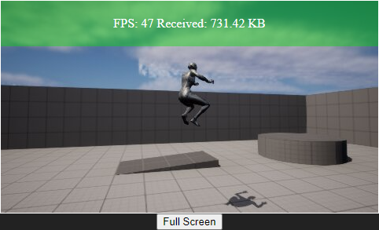
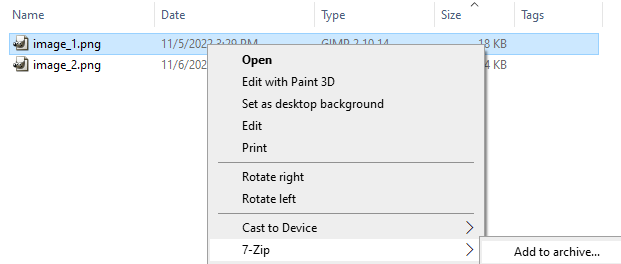

# UE5_Remote

This UE5 project uses a scene capture component on the character to send render textures through a WebSocket to the browser. The browser sends input back to UE5 so that the project can be interacted with on a remote machine or any device.

**Overview Video**

<div style="display: flex; flex-direction: row; justify-content: center; align-content: center; border: 2px solid red; padding: 5px; background: gray">
<a target="_blank" href="https://youtu.be/6XeScY7OwvY"></a>
</div>

## Quick Start

* Start the WebSocket Server - NodeJS

```cmd
Server\Node_InstallServer.cmd
Server\Node_StartServer.cmd
```

* Start the Browser Host - NodeJS

```cmd
Client\Node_InstallBrowserHost.cmd
Client\Node_StartBrowserHost.cmd
```

* Open the browser: [http://localhost:8001/index.html](http://localhost:8001/index.html)

* Launch the UE5 project

```cmd
UE5_Remote\UE5_Remote.uproject
```

## Components

### WebSocket Server

The `WebSocket Server` relays streaming binary images to clients.

* Dependency: [websockets/ws](https://github.com/websockets/ws)

* `WebSocket Server` [Server/app.js](Server/app.js)

```
cd Server
npm install
node app.js
```

### HTML5 Client

The HTML5 client uses a WebSocket client to receive binary images and display in an img element.

WebSocket clients can send player input to the `Unreal Remote Host` by using WebSocket messages. Clients can inject keyboard and mouse input into the `Unreal Remote Host`.


### UE5 Remote Host

The [Unreal Remote Host](UE5_Remote/UE5_Remote.uproject) is an `UE5` project that uses a render texture and a WebSocket client to send binary image data to clients. Clients display the binary images. The UE5 project extends the third person perspective game template.

## Unit Tests

* [Server/sendImage.js](Server/sendImage.js) sends an image to the `WebSocket Server` that the client displays.


* [Server/sendHD.js](Server/sendHD.js) sends a HD image to the `WebSocket Server` to load test the browser.

```
node .\sendHD.js
Image length 3239333
2022-11-06T12:10:50.187Z Connection opened 0
2022-11-06T12:10:50.216Z Connection opened 1
2022-11-06T12:10:50.217Z Connection opened 2
2022-11-06T12:10:51.223Z Connection 0 Sent 139.02 MB
2022-11-06T12:10:51.246Z Connection 1 Sent 135.93 MB
2022-11-06T12:10:51.247Z Connection 2 Sent 135.93 MB
```

## Change Log

* Added [UE5_Remote/Content/UI/BPWidget_UI.uasset](UE5_Remote/Content/UI/BPWidget_UI.uasset) - BP Widget

* Updated Source: [UE5_Remote/Source/UE5_Remote/UE5_RemoteCharacter.h](UE5_Remote/Source/UE5_Remote/UE5_RemoteCharacter.h)

Add RenderTarget include:

```C++
#include "Engine/CanvasRenderTarget2D.h"
```

Add BP Function:

```C++
 UFUNCTION(BlueprintCallable, Category = "Capture")
 UTextureRenderTarget2D* CreateRenderTarget(const int32 width, const int32 height);
```

* Updated Source: [UE5_Remote/Source/UE5_Remote/UE5_RemoteCharacter.cpp](UE5_Remote/Source/UE5_Remote/UE5_RemoteCharacter.cpp)

Implement function:

```C++
UTextureRenderTarget2D* AUE5_RemoteCharacter::CreateRenderTarget(const int32 width, const int32 height)
{
 UTextureRenderTarget2D* RenderTarget = NewObject<UTextureRenderTarget2D>();

 RenderTarget->RenderTargetFormat = ETextureRenderTargetFormat::RTF_RGBA8;

 RenderTarget->InitAutoFormat(width, height);
 RenderTarget->UpdateResourceImmediate(true);

 return RenderTarget;
}
```

* Updated [UE5_Remote/Content/ThirdPerson/Blueprints/BP_ThirdPersonCharacter.uasset](UE5_Remote/Content/ThirdPerson/Blueprints/BP_ThirdPersonCharacter.uasset) - Event Graph

* BeginPlay: calls `InitUI` and `SetupRenderTexture` custom events.

* InitUI: Loads UI BP Widget and saves to `Widget` variable.

* SetupRenderTexture: Creates `UTextureRenderTarget2D` and saves to `RenderTexture` variable.

* Updated Source: [UE5_Remote/Source/UE5_Remote/UE5_RemoteCharacter.h](UE5_Remote/Source/UE5_Remote/UE5_RemoteCharacter.h)

Add class prototype:

```C++
class USceneCaptureComponent2D;
```

Add protected property for camera capture component:

```C++
UPROPERTY(VisibleAnywhere, BlueprintReadOnly, Category = Camera)
USceneCaptureComponent2D* CaptureComp;
```

* Updated Source: [UE5_Remote/Source/UE5_Remote/UE5_RemoteCharacter.cpp](UE5_Remote/Source/UE5_Remote/UE5_RemoteCharacter.cpp)

Include SceneCaptureComponent2D:

```C++
#include "Components/SceneCaptureComponent2D.h"
```

Attach Capture Component to the Camera Boom:

```C++
CaptureComp = CreateDefaultSubobject<USceneCaptureComponent2D>(TEXT("CaptureComp"));
if (CaptureComp)
{
  CaptureComp->SetupAttachment(CameraBoom);
}
```

* The BP Viewport will show the new capture component - [UE5_Remote/Content/ThirdPerson/Blueprints/BP_ThirdPersonCharacter.uasset](UE5_Remote/Content/ThirdPerson/Blueprints/BP_ThirdPersonCharacter.uasset)


* The texture target of the CaptureComponent has not been set yet.


* Create [UE5_Remote/Content/Materials/RenderTarget2D_Capture.uasset](UE5_Remote/Content/Materials/RenderTarget2D_Capture.uasset) render target at 480x270. This is 1/4 of 1080p by design.

* Set the Texture Target to use the `RenderTarget2D_Capture` RenderTarget.


* Set the `Capture Source` to `Final Color (LDR) in RGB`.


* Updated Source: [UE5_Remote/Source/UE5_Remote/UE5_RemoteCharacter.h](UE5_Remote/Source/UE5_Remote/UE5_RemoteCharacter.h)

Add BP Functions:

```C++
UFUNCTION(BlueprintCallable, Category = "Capture")
bool GetRawData(UTextureRenderTarget2D* TexRT, TArray<uint8>& RawData);

UFUNCTION(BlueprintCallable, Category = "Capture")
void SendRenderTexture(UTextureRenderTarget2D* TextureRenderTarget);
```

* Updated Source: [UE5_Remote/Source/UE5_Remote/UE5_RemoteCharacter.cpp](UE5_Remote/Source/UE5_Remote/UE5_RemoteCharacter.cpp)

Add implementation for getting raw data bytes from render texture.

```C++
// From: C:\Program Files\Epic Games\UE_4.21\Engine\Source\Runtime\Engine\Private\ImageUtils.cpp
bool AUE5_RemoteCharacter::GetRawData(UTextureRenderTarget2D* TexRT, TArray<uint8>& RawData)
{
 FRenderTarget* RenderTarget = TexRT->GameThread_GetRenderTargetResource();
 EPixelFormat Format = TexRT->GetFormat();

 int32 ImageBytes = CalculateImageBytes(TexRT->SizeX, TexRT->SizeY, 0, Format);
 RawData.AddUninitialized(ImageBytes);
 bool bReadSuccess = false;
 switch (Format)
 {
 case PF_FloatRGBA:
 {
  TArray<FFloat16Color> FloatColors;
  bReadSuccess = RenderTarget->ReadFloat16Pixels(FloatColors);
  FMemory::Memcpy(RawData.GetData(), FloatColors.GetData(), ImageBytes);
 }
 break;
 case PF_B8G8R8A8:
  bReadSuccess = RenderTarget->ReadPixelsPtr((FColor*)RawData.GetData());
  break;
 }
 if (bReadSuccess == false)
 {
  RawData.Empty();
 }
 return bReadSuccess;
}
```

Add headers:

```C++
#include "ImageUtils.h"
#include "IImageWrapper.h"
#include "IImageWrapperModule.h"
#include "RenderUtils.h"
```

* Add `ImageWrapper`, `RenderCore`, and `RHI` modules to [UE5_Remote/Source/UE5_Remote/UE5_Remote.Build.cs](UE5_Remote/Source/UE5_Remote/UE5_Remote.Build.cs)

```C#
PublicDependencyModuleNames.AddRange(new string[] { "Core", "CoreUObject", "Engine", "InputCore", "HeadMountedDisplay", "ImageWrapper", "RenderCore", "RHI" });
```

* Regenerate the Visual Studio project files after a module change.

Include Websockets headers:

```C++
#include "WebSocketsModule.h"
#include "IWebSocket.h"
```

* Add `WebSockets` module to [UE5_Remote/Source/UE5_Remote/UE5_Remote.Build.cs](UE5_Remote/Source/UE5_Remote/UE5_Remote.Build.cs)

```C#
PublicDependencyModuleNames.AddRange(new string[] { "Core", "CoreUObject", "Engine", "InputCore", "HeadMountedDisplay", "ImageWrapper", "RenderCore", "RHI", "WebSockets" });
```

* Updated Source: [UE5_Remote/Source/UE5_Remote/UE5_RemoteCharacter.h](UE5_Remote/Source/UE5_Remote/UE5_RemoteCharacter.h)

* Add include for `IWebSocket`

```C++
#include "IWebSocket.h"
```

* Add WebSocket protected data member.

```C++
TSharedPtr<IWebSocket> WebSocket;
```

* Override `BeginPlay` and `EndPlay`:

```C++
virtual void BeginPlay() override;

virtual void EndPlay(const EEndPlayReason::Type EndPlayReason) override;
```

* Updated Source: [UE5_Remote/Source/UE5_Remote/UE5_RemoteCharacter.cpp](UE5_Remote/Source/UE5_Remote/UE5_RemoteCharacter.cpp)

* Implement `BeginPlay`:

```C++
void AUE5_RemoteCharacter::BeginPlay()
{
 Super::BeginPlay();

 if (!FModuleManager::Get().IsModuleLoaded("WebSockets"))
 {
  FModuleManager::Get().LoadModule("WebSockets");
 }

 WebSocket = FWebSocketsModule::Get().CreateWebSocket("ws://localhost:8080");

 WebSocket->OnConnected().AddLambda([]()
  {
   GEngine->AddOnScreenDebugMessage(-1, 5.f, FColor::Green, "Successfully connected");
  });

 WebSocket->OnConnectionError().AddLambda([](const FString& Error)
  {
   GEngine->AddOnScreenDebugMessage(-1, 5.f, FColor::Red, Error);
  });

 WebSocket->OnClosed().AddLambda([](int32 StatusCode, const FString& Reason, bool bWasClean)
  {
   GEngine->AddOnScreenDebugMessage(-1, 5.f, bWasClean ? FColor::Green : FColor::Red, "Connection closed " + Reason);
  });

 WebSocket->OnMessage().AddLambda([](const FString& MessageString)
  {
   GEngine->AddOnScreenDebugMessage(-1, 5.f, FColor::Green, MessageString);
  });

 WebSocket->Connect();
}
```

* Implement `EndPlay`:

```C++
void AUE5_RemoteCharacter::EndPlay(const EEndPlayReason::Type EndPlayReason)
{
 if (WebSocket->IsConnected())
 {
  WebSocket->Close();
 }

 Super::EndPlay(EndPlayReason);
}
```

* Implement `SendRenderTexture`:

```C++
void AUE5_RemoteCharacter::SendRenderTexture(UTextureRenderTarget2D* TextureRenderTarget)
{
 //UE_LOG(LogTemp, Log, TEXT("Client sending over WebSocket"));

 if (WebSocket->IsConnected() && TextureRenderTarget)
 {
  if (TextureRenderTarget->GetFormat() != PF_B8G8R8A8)
  {
   EPixelFormat TextureFormat = TextureRenderTarget->GetFormat();
   UE_LOG(LogTemp, Log, TEXT("Render Target is not in the expected format should be 'PF_B8G8R8A8' instead found '%s'!"),
    GetPixelFormatString(TextureFormat));
  }
  else
  {
   check(TextureRenderTarget != nullptr);
   FRenderTarget* RenderTarget = TextureRenderTarget->GameThread_GetRenderTargetResource();
   FIntPoint Size = RenderTarget->GetSizeXY();

   TArray<uint8> RawData;
   bool bSuccess = GetRawData(TextureRenderTarget, RawData);

   IImageWrapperModule& ImageWrapperModule = FModuleManager::Get().LoadModuleChecked<IImageWrapperModule>(TEXT("ImageWrapper"));

   //TSharedPtr<IImageWrapper> ImageWrapper = ImageWrapperModule.CreateImageWrapper(EImageFormat::BMP); //crash probably too large
   //TSharedPtr<IImageWrapper> ImageWrapper = ImageWrapperModule.CreateImageWrapper(EImageFormat::PNG); // 10 FPS Max
   TSharedPtr<IImageWrapper> ImageWrapper = ImageWrapperModule.CreateImageWrapper(EImageFormat::JPEG); // 30 FPS

   ImageWrapper->SetRaw(RawData.GetData(), RawData.GetAllocatedSize(), Size.X, Size.Y, ERGBFormat::BGRA, 8);

   //const TArray64<uint8>& ImageData = ImageWrapper->GetCompressed(100); //largest size
   const TArray64<uint8>& ImageData = ImageWrapper->GetCompressed(0); //smallest size

   WebSocket->Send((void*)ImageData.GetData(), ImageData.GetAllocatedSize(), true);
  }
 }
 else
 {
  UE_LOG(LogTemp, Log, TEXT("HTTP module not available!"));
 }
}
```

## Blueprints

* Updated [UE5_Remote/Content/ThirdPerson/Blueprints/BP_ThirdPersonCharacter.uasset](UE5_Remote/Content/ThirdPerson/Blueprints/BP_ThirdPersonCharacter.uasset) - Event Graph

* The `SetupRenderTexture` custom event sets up the RenderTexture called from the `EventPlay` event.


* The `SendRenderTextureToWebSocket` custom event sends image data limited by the `RefreshRate` variable.


* The `EventTick` calls the custom event.


## WebSocket Input

* Add `Json` module to [UE5_Remote/Source/UE5_Remote/UE5_Remote.Build.cs](UE5_Remote/Source/UE5_Remote/UE5_Remote.Build.cs)

```C#
PublicDependencyModuleNames.AddRange(new string[] { "Core", "CoreUObject", "Engine", "InputCore", "HeadMountedDisplay", "ImageWrapper", "RenderCore", "RHI", "WebSockets", "Json" });
```

* Updated Source: [UE5_Remote/Source/UE5_Remote/UE5_RemoteCharacter.cpp](UE5_Remote/Source/UE5_Remote/UE5_RemoteCharacter.cpp)

Add includes for `Json`:

```C++
#include "Dom/JsonObject.h"
#include "Serialization/JsonReader.h"
```

Update OnMessage with `Json` parsing:

```C++
WebSocket->OnMessage().AddLambda([](const FString& MessageString)
  {
   TSharedPtr<FJsonObject> JsonObject = MakeShareable(new FJsonObject());
   TSharedRef<TJsonReader<>> JsonReader = TJsonReaderFactory<>::Create(MessageString);
   if (FJsonSerializer::Deserialize(JsonReader, JsonObject) && JsonObject.IsValid())
   {
    FString InputString;
    if (JsonObject->TryGetStringField("input", InputString))
    {
     if (InputString.Equals("mouse"))
     {
      int32 X = JsonObject->GetIntegerField("x");
      int32 Y = JsonObject->GetIntegerField("y");
     }
     else if (InputString.Equals("keydown"))
     {
      FString Key;
      if (JsonObject->TryGetStringField("key", Key))
      {
       if (Key.Equals("w"))
       {
       }
       else if (Key.Equals("a"))
       {
       }
       else if (Key.Equals("s"))
       {
       }
       else if (Key.Equals("d"))
       {
       }
       else if (Key.Equals("space"))
       {
       }
      }
     }
     else if (InputString.Equals("keyup"))
     {
      FString Key;
      if (JsonObject->TryGetStringField("key", Key))
      {
       if (Key.Equals("w"))
       {
       }
       else if (Key.Equals("a"))
       {
       }
       else if (Key.Equals("s"))
       {
       }
       else if (Key.Equals("d"))
       {
       }
       else if (Key.Equals("space"))
       {
       }
      }
     }
    }
   }
   else
   {
    GEngine->AddOnScreenDebugMessage(-1, 5.f, FColor::Green, "OnMessage: " + MessageString);
   }
  });
```

* Turn on RunInBackground so when the browser has focus the game still reacts quickly to input and rendering.

Go to `Edit->Editor Preferences->Miscellaneous` and disable the `Use Less CPU When in Background` option.


* Updated Source: [UE5_Remote/Source/UE5_Remote/UE5_RemoteCharacter.h](UE5_Remote/Source/UE5_Remote/UE5_RemoteCharacter.h)

Add protected data members that will be toggled from the WASD key socket events.

```C++
bool InjectKeyW;
bool InjectKeyA;
bool InjectKeyS;
bool InjectKeyD;
bool InjectKeySpace;
```

This also will need an update tick to inject the input.

```C++
virtual void Tick(float DeltaTime) override;
```

* Updated Source: [UE5_Remote/Source/UE5_Remote/UE5_RemoteCharacter.cpp](UE5_Remote/Source/UE5_Remote/UE5_RemoteCharacter.cpp)

Initialize the data members and turn on the tick event.

```C++
AUE5_RemoteCharacter::AUE5_RemoteCharacter()
{
 InjectKeyW = false;
 InjectKeyA = false;
 InjectKeyS = false;
 InjectKeyD = false;
 InjectKeySpace = false;

 // Set this character to call Tick() every frame.  You can turn this off to improve performance if you don't need it.
 PrimaryActorTick.bCanEverTick = true;
```

Add a tick event to inject input:

```C++
// Called every frame
void AUE5_RemoteCharacter::Tick(float DeltaTime)
{
 Super::Tick(DeltaTime);

 if (InjectKeyW)
 {
  MoveForward(1);
 }
 else if (InjectKeyS)
 {
  MoveForward(-1);
 }
 
 if (InjectKeyA)
 {
  MoveRight(-1);
 }
 else if (InjectKeyD)
 {
  MoveRight(1);
 }
}
```

Toggle WASD key injection from the socket message:

```C++
WebSocket->OnMessage().AddLambda([this](const FString& MessageString)
{
  TSharedPtr<FJsonObject> JsonObject = MakeShareable(new FJsonObject());
  TSharedRef<TJsonReader<>> JsonReader = TJsonReaderFactory<>::Create(MessageString);
  if (FJsonSerializer::Deserialize(JsonReader, JsonObject) && JsonObject.IsValid())
  {
  FString InputString;
  if (JsonObject->TryGetStringField("input", InputString))
  {
    if (InputString.Equals("mouse"))
    {
    int32 X = JsonObject->GetIntegerField("x");
    int32 Y = JsonObject->GetIntegerField("y");
    }
    else if (InputString.Equals("keydown"))
    {
    FString Key;
    if (JsonObject->TryGetStringField("key", Key))
    {
      if (Key.Equals("w"))
      {
        InjectKeyW = true;
      }
      else if (Key.Equals("a"))
      {
        InjectKeyA = true;
      }
      else if (Key.Equals("s"))
      {
        InjectKeyS = true;
      }
      else if (Key.Equals("d"))
      {
        InjectKeyD = true;
      }
      else if (Key.Equals("space"))
      {
        if (!InjectKeySpace)
        {
         InjectKeySpace = true;
         Jump();
        }
      }
    }
    }
    else if (InputString.Equals("keyup"))
    {
    FString Key;
    if (JsonObject->TryGetStringField("key", Key))
    {
      if (Key.Equals("w"))
      {
        InjectKeyW = false;
      }
      else if (Key.Equals("a"))
      {
        InjectKeyA = false;
      }
      else if (Key.Equals("s"))
      {
        InjectKeyS = false;
      }
      else if (Key.Equals("d"))
      {
        InjectKeyD = false;
      }
      else if (Key.Equals("space"))
      {
        InjectKeySpace = false;
        StopJumping();
      }
    }
    }
  }
  }
  else
  {
  GEngine->AddOnScreenDebugMessage(-1, 5.f, FColor::Green, "OnMessage: " + MessageString);
  }
});
```

Add mouse input by sending values to the mouse input actions from the socket message.

```C++
if (InputString.Equals("mouse"))
{
  int32 X = JsonObject->GetIntegerField("x");
  int32 Y = JsonObject->GetIntegerField("y");

  AddControllerYawInput(X);
  AddControllerPitchInput(Y);
}
```

## Upscaling

AI Models can do fast super resolution upscaling on the 480x270 images to create HD resolution images in the client. This allows for faster framerates using lower bandwidth.

Here you can see a example of output from [UpscalerJS](https://upscalerjs.com/).

* Before: (Original size: 480x270)


* After: (Upscaled size: 1920x1080)


The images used to train AI models will influence the artist style of the upscaled images. In this case, the JPG compression marks in the upscale output from the pre-trained model look similar to hand painted artwork. For more information on training datasets take a look at [Image Super Resolution Datasets](https://paperswithcode.com/task/image-super-resolution).


## Performance

* `sendHD.js` can sends `hundreds of MB per second` and the browser can only receive around `10 FPS`. Reducing the file size of the image with more optimal compression, increases the browser FPS to `12`. Using multiple WebSockets does not increase the FPS in the browser. The browser seems to be throttled by `20+ MB per second`. Stopping the test shows the browser to continue buffering for several seconds.

```
node .\sendHD.js
Image length 3239333
2022-11-06T17:07:45.246Z Connection opened 0
2022-11-06T17:07:45.249Z Connection opened 1
2022-11-06T17:07:45.249Z Connection opened 2
2022-11-06T17:07:46.257Z Connection 0 Sent 64.87 MB
2022-11-06T17:07:46.258Z Connection 1 Sent 61.79 MB
2022-11-06T17:07:46.259Z Connection 2 Sent 61.79 MB
```

* Sending HD full throttle can go up by hundreds of MB sent even though the receiving end is a fraction of that.

```
2022-11-06T17:22:55.982Z Connection 0 Sent 447.94 MB
```


* `send270pFull.js` sends `480x270` images as fast as possible resulting in `200+ FPS` in the browser. Multiple WebSockets can be used so that rendering and input have dedicated WebSockets.

```
node .\send270pFull.js 
Image length 17480
2022-11-06T17:45:16.530Z Connection opened 1
2022-11-06T17:45:16.535Z Connection opened 0
2022-11-06T17:45:16.536Z Connection opened 2
2022-11-06T17:45:17.543Z Connection 1 Sent 1.43 MB
2022-11-06T17:45:17.544Z Connection 0 Sent 1.4 MB
2022-11-06T17:45:17.544Z Connection 2 Sent 1.4 MB
```


* `send270p60FPS.js` sends `480x270` images and is capped at `60 FPS` at `1 MB per second`. Multiple WebSockets or a single WebSocket can be used. `60 FPS` frame rates are attainable easily at this resolution.

```
node .\send270p60FPS.js
Image length 17480
2022-11-06T17:43:41.018Z Connection opened 1
2022-11-06T17:43:41.021Z Connection opened 0
2022-11-06T17:43:41.022Z Connection opened 2
2022-11-06T17:43:42.034Z Connection 1 Sent 358.48 KB
2022-11-06T17:43:42.035Z Connection 0 Sent 358.48 KB
2022-11-06T17:43:42.036Z Connection 2 Sent 358.48 KB
```


* Updated the [UE5_Remote/Content/ThirdPerson/Blueprints/BP_ThirdPersonCharacter.uasset](UE5_Remote/Content/ThirdPerson/Blueprints/BP_ThirdPersonCharacter.uasset) - Event Graph


* Update the `RefreshRate` variable to `0.013`.

* The `EventTick` appears to be capped at `30 FPS`.


* The `EventTick` seems to be limited `50 FPS` and so the logic for `SendRenderTextureToWebSocket` should move to a thread.


* Instead of using `EventTick`, now `BeginPlay` calls the `StartSendRenderTextureEvent` custom event. The event uses a delay that uses the `RefreshRate`. This simplifies the logic. Without the `SendRenderTexture` node the `TicksPerSecond` can hit `60 FPS`. The `SendRenderTexture` seems to be taking too long and slowing down the FPS. Setting `RefreshRate` to zero still hits `30 FPS` so either the WebSocket or RenderTexture is capping the rate.


Switch to an array of WebSockets.

```C++
TArray<TSharedPtr<IWebSocket>> WebSockets;
int32 MaxRenderWebSockets;
int32 IndexWebSocket; //cycle WebSockets
```

Initialize the index.

```C++
MaxRenderWebSockets = 3;
IndexWebSocket = 0;
```

Input will be on its own socket.

```C++
TSharedPtr<IWebSocket> WebSocket = FWebSocketsModule::Get().CreateWebSocket("ws://localhost:8080/?type=input");
```

Initialize the new WebSockets.

```C++
for (int index = 0; index < MaxRenderWebSockets; ++index)
{
  TSharedPtr<IWebSocket> WebSocketAlt = FWebSocketsModule::Get().CreateWebSocket("ws://localhost:8080/?type=render");
  WebSocketAlt->Connect();
  WebSockets.Add(WebSocketAlt);
}
```

Cycle between the render WebSockets.

```C+++
// The zero index is the input WebSocket

TSharedPtr<IWebSocket> WebSocket = WebSockets[IndexWebSocket + 1];
IndexWebSocket = (IndexWebSocket + 1) % MaxRenderWebSockets; // cycle between web sockets
```

Unreal is now sending `47 FPS`. Increasing the WebSockets doesn't seem to affect the FPS. Having the input and rendering on separate `WebSockets` has a better design.



* The `47 FPS` could be capped by how long it takes to create the JPG image. It might be possible to send the `RenderTexture` in the native format and get the browser to decode that format.

* Move ImageWrapper and RawData allocation from the function to the class data members.

```C++
#include "IImageWrapper.h"
```

```C++
TSharedPtr<IImageWrapper> ImageWrapper;
TArray<uint8> RenderTextureRawData;
```

* Initialize the data members.

```C++
IImageWrapperModule& ImageWrapperModule = FModuleManager::Get().LoadModuleChecked<IImageWrapperModule>(TEXT("ImageWrapper"));
ImageWrapper = ImageWrapperModule.CreateImageWrapper(EImageFormat::JPEG); // 30 FPS
RenderTextureRawData.AddUninitialized(480 * 270 * 4);
```

* Optimize the `SendRenderTexture` function.

```C++
void AUE5_RemoteCharacter::SendRenderTexture(UTextureRenderTarget2D* TextureRenderTarget)
{
 //UE_LOG(LogTemp, Log, TEXT("Client sending over WebSocket"));
 // The zero index is the input WebSocket
 TSharedPtr<IWebSocket> WebSocket = WebSockets[IndexWebSocket + 1];
 IndexWebSocket = (IndexWebSocket + 1) % MaxRenderWebSockets; // cycle between web sockets

 if (WebSocket->IsConnected() && TextureRenderTarget)
 {
  check(TextureRenderTarget != nullptr);
  FRenderTarget* RenderTarget = TextureRenderTarget->GameThread_GetRenderTargetResource();

  bool bSuccess = RenderTarget->ReadPixelsPtr((FColor*)RenderTextureRawData.GetData());
  if (bSuccess)
  {
   ImageWrapper->SetRaw(RenderTextureRawData.GetData(), RenderTextureRawData.GetAllocatedSize(), 480, 270, ERGBFormat::BGRA, 8);
   const TArray64<uint8>& ImageData = ImageWrapper->GetCompressed(0); //smallest size
   WebSocket->Send((void*)ImageData.GetData(), ImageData.GetAllocatedSize(), true);
  }
 }
}
```

* Optimize the chracter blueprint to prepare for multithreading. The render texture can just be a private data field. There's no need to pass it around in blueprints. Add a node to start an async worker that will render in and send in a thread.


* Create a `SendRenderTextureTask` class that extends `FNonAbandonableTask`.

```C++
class SendRenderTextureTask : public FNonAbandonableTask
{
public:
 SendRenderTextureTask(AUE5_RemoteCharacter* Actor);

 ~SendRenderTextureTask();

 FORCEINLINE TStatId GetStatId() const
 {
  RETURN_QUICK_DECLARE_CYCLE_STAT(SendRenderTextureTask, STATGROUP_ThreadPoolAsyncTasks);
 }

 void DoWork();
private:
 AUE5_RemoteCharacter* Character;
 bool WaitForExit;
};
```

* Implement `SendRenderTextureTask`:

```C++
SendRenderTextureTask::SendRenderTextureTask(AUE5_RemoteCharacter* Actor)
{
 UE_LOG(LogTemp, Log, TEXT("SendRenderTextureTask()"));
 Character = Actor;
 WaitForExit = true;
}

SendRenderTextureTask::~SendRenderTextureTask()
{
 UE_LOG(LogTemp, Log, TEXT("~SendRenderTextureTask()"));
 WaitForExit = false;
}

void SendRenderTextureTask::DoWork()
{
 const float RefreshRate = 1 / 60.0f * 0.4;
 bool notStarted = true;
 while (WaitForExit && Character->WaitForExit)
 {
  if (notStarted)
  {
   notStarted = false;
   AsyncTask(ENamedThreads::GameThread, [this, &notStarted]() {
    // code to execute on game thread here
    Character->SendRenderTexture();
    notStarted = true;
   });
  }

  FWindowsPlatformProcess::Sleep(RefreshRate);
 }
}
```

There's a tricky balance here, where if the `RefreshRate` is too fast, rendering will queue up and playback will lag behind.

Capturing the render texture data actually has to run on the `GameThread`.

* `StartWorkerSendRenderTexture` spawns the background task to render and send to the WebSocket.

```C++
void AUE5_RemoteCharacter::StartWorkerSendRenderTexture()
{
 (new FAutoDeleteAsyncTask<SendRenderTextureTask>(this))->StartBackgroundTask();
}
```

* By using `SendRenderTextureTask` the `60 FPS` frame rate has been reached.


## Compression

* A quick test using `7-zip` with the various compression options shows the `17KB JPG` can be compressed to `16.9KB` with `GZIP`.



* Even a `0.1KB` drop can shave off `6KB` per second.

## Support

Support is available on Discord, you can reach me at `Tim Graupmann#0611`.
