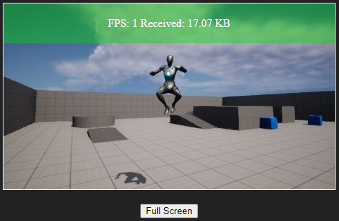

# UE5_Remote

POC - Video Streaming with UE5

## Components

### WebSocket Server

The `WebSocket Server` relays streaming binary images to clients.

* Dependency: [websockets/ws](https://github.com/websockets/ws)

* `WebSocket Server` [Server/app.js](Server/app.js)

```
cd Server
npm install
node app.js
```

### HTML5 Client

The HTML5 client uses a WebSocket client to receive binary images and display in an img element. The HTML5 client can also send input to the host by using WebSocket messages.


### UE5 Remote Host

The [Unreal Remote Host](UE5_Remote/UE5_Remote.uproject) is an UE5 project that uses a render texture and a WebSocket client to send binary image data to clients. Clients display the binary images and can send inputs back to the host to control the character. The UE5 project extends the third person perspective game template.

## Unit Tests

* [Server/sendImage.js](Server/sendImage.js) sends an image to the `WebSocket Server` that the client displays.



## Change Log

* Added [UE5_Remote/Content/UI/BPWidget_UI.uasset](UE5_Remote/Content/UI/BPWidget_UI.uasset) - BP Widget

* Updated Source: [UE5_Remote/Source/UE5_Remote/UE5_RemoteCharacter.h](UE5_Remote/Source/UE5_Remote/UE5_RemoteCharacter.h)

Add RenderTarget include:

```C++
#include "Engine/CanvasRenderTarget2D.h"
```

Add BP Function:

```C++
 UFUNCTION(BlueprintCallable, Category = "Capture")
 UTextureRenderTarget2D* CreateRenderTarget(const int32 width, const int32 height);
```

* Updated Source: [UE5_Remote/Source/UE5_Remote/UE5_RemoteCharacter.cpp](UE5_Remote/Source/UE5_Remote/UE5_RemoteCharacter.cpp)

Implement function:

```C++
UTextureRenderTarget2D* AUE5_RemoteCharacter::CreateRenderTarget(const int32 width, const int32 height)
{
 UTextureRenderTarget2D* RenderTarget = NewObject<UTextureRenderTarget2D>();

 RenderTarget->RenderTargetFormat = ETextureRenderTargetFormat::RTF_RGBA8;

 RenderTarget->InitAutoFormat(width, height);
 RenderTarget->UpdateResourceImmediate(true);

 return RenderTarget;
}
```

* Updated [UE5_Remote/Content/ThirdPerson/Blueprints/BP_ThirdPersonCharacter.uasset](UE5_Remote/Content/ThirdPerson/Blueprints/BP_ThirdPersonCharacter.uasset) - Event Graph

* BeginPlay: calls `InitUI` and `SetupRenderTexture` custom events.

* InitUI: Loads UI BP Widget and saves to `Widget` variable.

* SetupRenderTexture: Creates `UTextureRenderTarget2D` and saves to `RenderTexture` variable.

* Updated Source: [UE5_Remote/Source/UE5_Remote/UE5_RemoteCharacter.h](UE5_Remote/Source/UE5_Remote/UE5_RemoteCharacter.h)

Add class prototype:

```C++
class USceneCaptureComponent2D;
```

Add protected property for camera capture component:

```C++
UPROPERTY(VisibleAnywhere, BlueprintReadOnly, Category = Camera)
USceneCaptureComponent2D* CaptureComp;
```

* Updated Source: [UE5_Remote/Source/UE5_Remote/UE5_RemoteCharacter.cpp](UE5_Remote/Source/UE5_Remote/UE5_RemoteCharacter.cpp)

Include SceneCaptureComponent2DL

```C++
#include "Components/SceneCaptureComponent2D.h"
```

Attach Capture Component to the Camera Boom:

```C++
CaptureComp = CreateDefaultSubobject<USceneCaptureComponent2D>(TEXT("CaptureComp"));
if (CaptureComp)
{
  CaptureComp->SetupAttachment(CameraBoom);
}
```

* The BP Viewport will show the new capture component - [UE5_Remote/Content/ThirdPerson/Blueprints/BP_ThirdPersonCharacter.uasset](UE5_Remote/Content/ThirdPerson/Blueprints/BP_ThirdPersonCharacter.uasset)


* The texture target of the CaptureComponent has not been set yet.


* Create [UE5_Remote/Content/Materials/RenderTarget2D_Capture.uasset](UE5_Remote/Content/Materials/RenderTarget2D_Capture.uasset) render target at 480x270. This is 1/4 of 1080p by design.

* Set the Texture Target to use the `RenderTarget2D_Capture` RenderTarget.


* Updated Source: [UE5_Remote/Source/UE5_Remote/UE5_RemoteCharacter.h](UE5_Remote/Source/UE5_Remote/UE5_RemoteCharacter.h)

Add BP Functions:

```C++
UFUNCTION(BlueprintCallable, Category = "Capture")
bool GetRawData(UTextureRenderTarget2D* TexRT, TArray<uint8>& RawData);

UFUNCTION(BlueprintCallable, Category = "Capture")
void SendRenderTexture(UTextureRenderTarget2D* TextureRenderTarget);
```

* Updated Source: [UE5_Remote/Source/UE5_Remote/UE5_RemoteCharacter.cpp](UE5_Remote/Source/UE5_Remote/UE5_RemoteCharacter.cpp)

Add implementation for getting raw data bytes from render texture.

```C++
// From: C:\Program Files\Epic Games\UE_4.21\Engine\Source\Runtime\Engine\Private\ImageUtils.cpp
bool AUE5_RemoteCharacter::GetRawData(UTextureRenderTarget2D* TexRT, TArray<uint8>& RawData)
{
 FRenderTarget* RenderTarget = TexRT->GameThread_GetRenderTargetResource();
 EPixelFormat Format = TexRT->GetFormat();

 int32 ImageBytes = CalculateImageBytes(TexRT->SizeX, TexRT->SizeY, 0, Format);
 RawData.AddUninitialized(ImageBytes);
 bool bReadSuccess = false;
 switch (Format)
 {
 case PF_FloatRGBA:
 {
  TArray<FFloat16Color> FloatColors;
  bReadSuccess = RenderTarget->ReadFloat16Pixels(FloatColors);
  FMemory::Memcpy(RawData.GetData(), FloatColors.GetData(), ImageBytes);
 }
 break;
 case PF_B8G8R8A8:
  bReadSuccess = RenderTarget->ReadPixelsPtr((FColor*)RawData.GetData());
  break;
 }
 if (bReadSuccess == false)
 {
  RawData.Empty();
 }
 return bReadSuccess;
}
```

Add headers:

```C++
#include "ImageUtils.h"
#include "IImageWrapper.h"
#include "IImageWrapperModule.h"
```

Add implementation for sending `PNG` bytes to WebSocket server.

```C++

```

* Add `ImageWrapper`, `RenderCore`, and `RHI` modules to [UE5_Remote/Source/UE5_Remote/UE5_Remote.Build.cs](UE5_Remote/Source/UE5_Remote/UE5_Remote.Build.cs)

```C#
PublicDependencyModuleNames.AddRange(new string[] { "Core", "CoreUObject", "Engine", "InputCore", "HeadMountedDisplay", "ImageWrapper", "RenderCore", "RHI" });
```

* Regenerate the Visual Studio project files after a module change.
